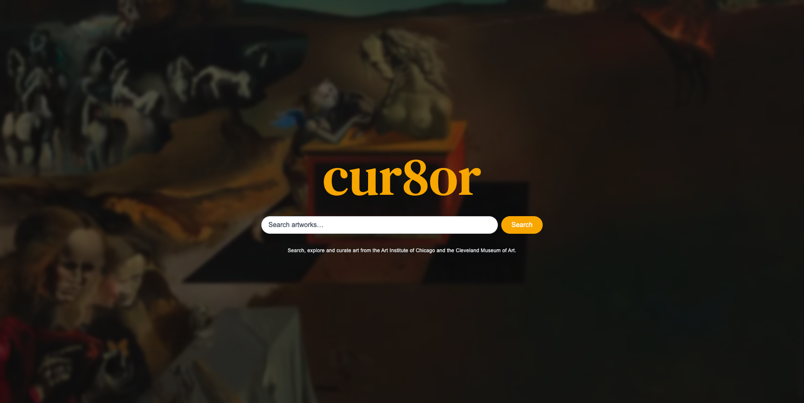
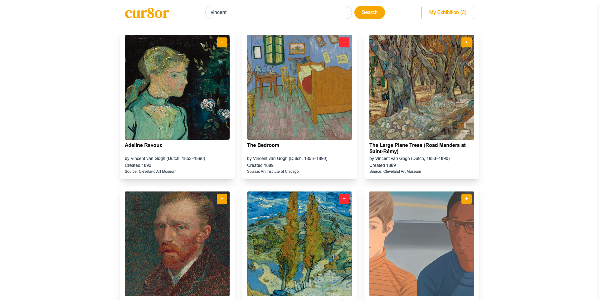
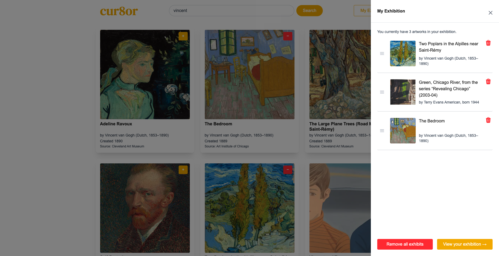
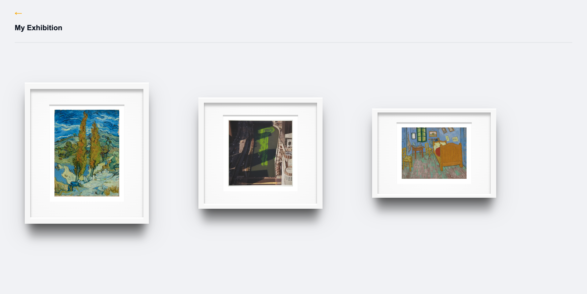

# cur8or 🎨

Curate your own virtual exhibition from real museum collections.

**cur8or** is a virtual exhibition builder that lets users search, browse and curate artworks from major public collections. Designed for art lovers, students and curators-in-training, the app allows anyone to create a themed exhibition using open-access artworks from leading museums.

- [Live demo](cur8or.vercel.app)

## ✨ Features

- 🔍 Unified search across two museum APIs (Cleveland Museum of Art & Art Institute of Chicago)
- 🖼️ Filter by image availability for cleaner browsing
- 🖱️ Interactive exhibition view with hover overlays, artwork modals and CSS-styled picture frames for realistic presentation
- ➕ Add or remove artworks to a personal exhibition collection
- 🖐️ Sort artworks using drag and drop
- 💾 Persistent exhibition and search state using Context + localStorage
- 🔗 Visit artwork entries directly on each museum’s website for more information
- 🎨 Responsive grid layout for search results
- 🌙 Background slideshow for empty state screens — a curated visual atmosphere
- 💡 Accessibility-friendly UI with proper ARIA roles, keyboard navigation and focus states
- 🧠 Normalised data model for consistent cross-museum data
- 🧩 Modular React components and a clear, type-safe architecture
- 🪶 Lightweight, server-side rendered pages for fast initial load and SEO-ready metadata

## 🧑‍💻 Tech Stack

- [Next.js](https://nextjs.org/) (App Router)
- [Tailwind CSS](https://tailwindcss.com/)
- TypeScript
- Fetching from public APIs (e.g. [Art Institute of Chicago](https://api.artic.edu/docs/), [Cleveland Museum of Art](https://openaccess-api.clevelandart.org/))

## 📦 Getting Started

Clone the repo:

```bash
git clone https://github.com/bluesky2006/cur8or.git
cd cur8or
```

Install dependencies:

```bash
npm install
```

Run the app locally:

```bash
npm run dev
```

The app will be available at `http://localhost:3000`.

## 🖼️ Example Screenshot






## 📚 Folder Structure

```
/
├── components/                     # Reusable UI components
│   ├── ArtworkDetailModal.tsx
│   ├── ArtworkItem.tsx
│   ├── ArtworkList.tsx
│   ├── BackgroundSlideshow.tsx
│   ├── ExhibitionArtworkItem.tsx
│   ├── ExhibitionArtworkModal.tsx
│   ├── ExhibitionDrawer.tsx
│   ├── Footer.tsx
│   ├── Header.tsx
│   ├── Logo.tsx
│   ├── MyExhibitionButton.tsx
│   ├── SearchBar.tsx
│   └── SortableItem.tsx
├── context/                        # Global contexts
│   ├── ExhibitionContext.tsx
│   └── SearchContext.tsx
├── lib/
│   └── adapters/                   # Normalises API responses from each museum
│       ├── aicAdapter.ts
│       └── cmaAdapter.ts
│   └── api/                        # Individual API calls for museum data
│       ├── aic.ts
│       ├── cma.ts
│       └── searchAllMuseums.ts
├── public/                         # Static assets
│   └── art-backgrounds/
├── src/
│   └── app/                        # Next.js App Router
│       └── my-exhibition/
│           └── page.tsx            # My Exhibition page
│       ├── globals.css
│       ├── layout.tsx
│       └── page.tsx                # Main landing page
├── types/
│   └── artTypes.ts                 # TypeScript types
```

## 📄 Licence

MIT — free to use, remix and extend.
