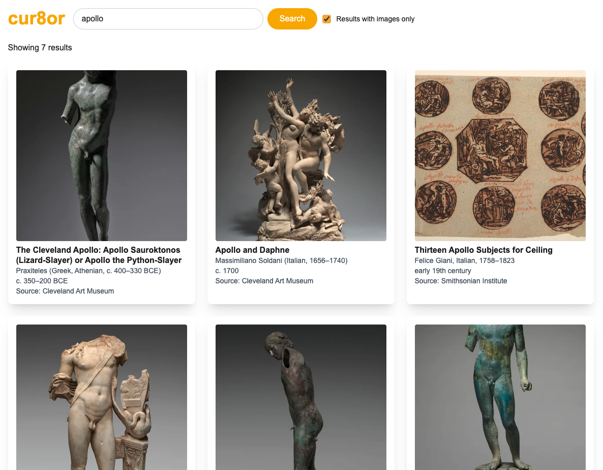

# cur8or 🎨

**cur8or** is a virtual exhibition builder that lets users search, browse and curate artworks from major public collections. Designed for art lovers, students and curators-in-training, the app allows anyone to create a themed exhibition using open-access artworks from leading museums.

## ✨ Features

- 🔍 Unified search across multiple museum APIs
- 🖼️ Filter by image availability
- 🎨 Responsive grid view of search results
- 🧠 Normalised data model for artworks
- 🚀 Fast, mobile-first experience with Next.js + Tailwind

## 🧑‍💻 Tech Stack

- [Next.js](https://nextjs.org/) (App Router)
- [Tailwind CSS](https://tailwindcss.com/)
- TypeScript
- Fetching from public APIs (e.g. [Smithsonian Institute](https://edan.si.edu/openaccess/apidocs/), [Cleveland Museum of Art](https://openaccess-api.clevelandart.org/))

## 📦 Getting Started

Clone the repo:

```bash
git clone https://github.com/bluesky2006/cur8or.git
cd cur8or
```

Install dependencies:

```bash
npm install
```

Run the app locally:

```bash
npm run dev
```

The app will be available at `http://localhost:3000`.

## 🔐 API Keys

The Smithsonian Institute API requires an API key, free to apply for via [the site](https://api.data.gov/signup/). Once you have one, create a `.env.local` file and add:

```env
NEXT_PUBLIC_SMITHSONIAN_API_KEY=your_api_key_here
```

## 🖼️ Example Screenshot



## 📚 Folder Structure

```
/
├── components/                     # Reusable UI components
│   ├── ArtworkItem.tsx
│   ├── ArtworkList.tsx
│   ├── LogoHeader.tsx
│   └── SearchBar.tsx
├── lib/
│   └── api/
│       ├── cmaSearch.ts            # Cleveland Museum API search
│       ├── searchAllMuseums.ts     # Combined museum search results
│       └── siSearch.ts             # Smithsonian Institute API search
│   └── adapters/
│       ├── cmaAdapter.ts           # Adapter for normalising Cleveland Museum search results into desired shape
│       └── siAdapter.ts            # Adapter for normalising Smithsonian Institute search results into desired shape
│   └── hooks/
│       └── useSearchState.ts       # Hook containing all state used in main landing page search
├── public/                         # Static assets
├── src/
│   └── app/                        # Next.js App Router
│       ├── globals.css
│       └── layout.tsx
│       └── page.tsx                # Main landing page
├── types/
│   └── artTypes.ts                 # Normalised artwork type
└── README.md                       # You are here
```

## 🚧 In Progress

- 🗃️ Saving artworks to a virtual “exhibition space”
- 🖼️ Exhibition view page with custom title and description
- 🧮 More sorting and filtering options
- 🔐 User login
- 🧹 TBD: Filter out search results without images

## 📄 Licence

MIT — free to use, remix and extend.

---

## 💡 About

Built as a final project for a JavaScript Skills Bootcamp by [Simon Busby](https://simonbusby.netlify.app). Inspired by a love of design, archives and accessible technology.
